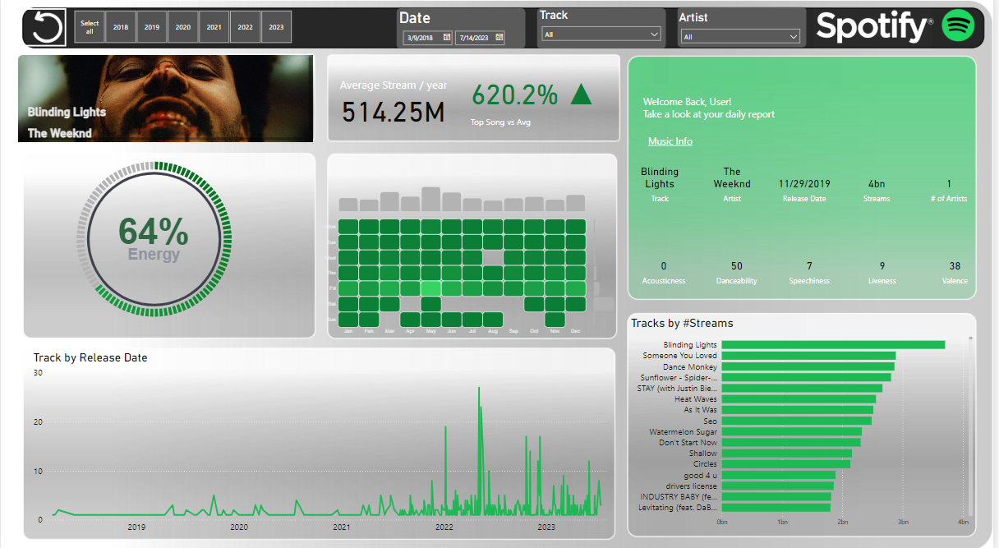

# Spotify_advanced_data_analysis

In conclusion, this exploration into Spotify’s top hits of 2023 reveals significant insights into the factors influencing song popularity in the digital age. Our analysis indicates that there are a variety of factors that can influence the popularity of a song including:

●	Artist Count: A significant finding is that a higher number of artists on a song correlates with fewer streams. This suggests a preference among Spotify users for solo artists or smaller collaborations.

●	Release Year: The analysis indicated a significant correlation between release year and number of streams. The songs released in later years were shown to have fewer streams. This trend may reflect evolving music consumption habits or market saturation.

●	Release Day and Liveness: Our analysis did not find these variables to significantly impact streaming numbers. These challenges some common assumptions in the music industry about the importance of specific release days and the role of liveness in streaming success.

●	Other Variables (Release Month, Danceability, Energy, and Speechiness): The remaining variables that we tested, release month, danceability, energy, and speechiness, showed to be insignificant, indicating no significant influence on the number of streams. 

These findings not only enhance our understanding of music streaming dynamics but also offer practical guidance for industry stakeholders seeking to optimize their digital presence. While mindful of its limitations, such as accounting for only single year data instead of long-term data, ignoring the data from other streaming platforms, and overlooking possible qualitative elements, this study lays groundwork for future research. These limitations pose new research opportunities, delving into more broad and diverse data gathering such as streaming numbers from several other streaming platforms, historical streaming data, and incorporating qualitative methods. As the digital music landscape continues to evolve, studies like ours become pivotal in identifying the elements of success in an increasingly competitive market.
